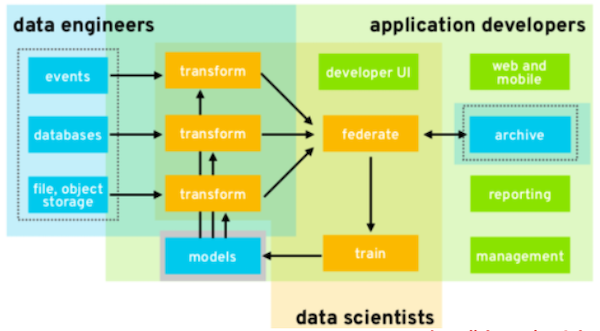
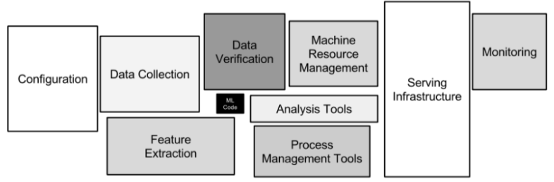
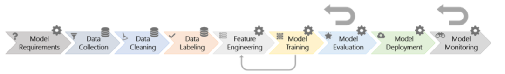

 ## About this book

 This book is about using better software engineering to build better AI software. Most of our case studies come from our experience in applying AI to software engineering-- which means that **this book is about  SE for AI for SE**.

 AI is a very broad topic, discussed in
 [so](REFS.md#norvig-2009) 
 [very](REFS.md#grus--2019)
 [many](REFS.md#duda-2000)
 [other](REFS.md#witten-2016)
 books. What make this book different is trhee things. Firstly,  we look
 at 
 AI tools that have had much recent   impact on software
 engineering. Specifically, we will talk a lot about data mining algorithms;
 some about optimizers; and a little about theorem provers
 (and we say more about  all these, [below](#3tools)).

 Secondly, the authors of this book have spent decades applying many data mining methods (primarily for software engineering applications). We share some of that case study experience in this book.

 Thirdly, in this book, **ethics are a primary design principle**.  We assert that the design goals for SE-for-AI must be _ethically-aligned design_ to prioritize human well-being.   It is ethical to improve the profits of your company since that money becomes wages which becomes groceries which becomes dinner so everyone and their kids can sleep content at night.  It is also ethical to change the design of AI software in order to ensure   that (say) the software is not unduly discriminatory towards a particular social group (e.g. some groups characterized by age, race, or gender). To get us going, the  next chapter of this book will review principles of  ethically-aligned design, as well as the algorithms that might support such design.  We suggest to you that when you start a new AI project:

 - Your  first question should not be  be  "what data miners should I apply to this data?";
 - Rather, it should be  "what are the ethical requirements of this development? And how can we best support those requirements?".
  
  ## But is "SE for AI" that important?

  It is timely to talk about SE for AI.  **AI software is still software**. And any  software
   (be it AI software, or otherwise) needs installation, configuration, maintenance, interfacing to other software, testing, certification,  user support, usability additions, and packaging (for distribution). As shown below, Bill Benton from Redhat [reports that](REFS.md/#benton-2019) that when we look at the data mining pipelines used to distribute and scale AI tools, there is  much overlap between the activities of data scientists and   more traditional activities  like data engineer and application developer. That is,   
   **AI software needs care and feeding by software engineersi**. 

<p align="center">
  
</p>

   Another reason to explore SE for AI is that  
   **most "AI software" is not about AI**.   David Sculley  [offers the following  diagram](REFS.md/#sculley-2015) showing the size (in lines of code) of  Google's software suite. Note how small is the AI box (shown in black), buried away in the middle of all the other software.

<p align="center">
  
</p>


   Since AI software is still software, it follows that 
   **poor software engineering leads to poor AI**. Again, David Sculley [offers us an example of this](REFS.md/#sculley-2015).  He reports that Google's machine learning developers used all of the attributes in Google's data dictionaries to learn predictive models about browsing habits. This lead to problems since any subsequent change in the data dictionary meant that all the data mining had to be done, all over again. In software engineering terms, Google had introduce technical debt (i.e. something that will consume maintenance money at some future date) by violating principles of coupling and cohesion. Maintainable systems are loosely coupled (but internally, tightly cohesive). Google's classifiers, on the other hand were tightly coupled with their data dictionaries.
   A better design, that would have looser coupling would have been to apply some sort of feature weighting to the data, and only connect to the least features that were most influential.

<p align="center">
  
</p>


   While poor software engineering can lead to problems with the AI, the good news is that 
   **better SE can lead to better AI**. For example, many industrial data scientists make extensive  use of the [Python scikit-learn toolkit](REFS.md#pedregosa-2011) data mining package. Started in 2007 as a Google Summer of Code project by David Cournapeau, numerous releases have appeared following a (approximately) three month cycle, and a thriving international community has been leading the development. At the time of this writing, over the last month, this software has been maintained and extended by dozens of authors, spread around the planet (specifically, excluding merges, 50 authors have pushed 119 commits to master and 119 commits to all branches to make changes thousands of lines of code in  279 files). All this is possible since scikit-learn uses state-of-the-art open source software engineering methods (continuous integration, cloud-based testing with Travis CI, git, github, etc etc). 

   Since good SE can lead to better AI, we devoted many  chapters of this book to industrial data mining pipelines.   Recently we reversed engineering a nine step pipeline for industrial machine learning.  For simplicity's sake, we draw it as steps that run left to right (but in reality, **AI is an agile process** where we jump around these steps, as required):

<p align="center">
  
</p>

   We also surveyed many industrial data scientists to understand how much time they spend on different parts of this pipeline:

|part|hrs/week<br>(mean, approx)|bar chart|
|------------|---|-----------------------------------------------------|
|requirements|4.4|          |
|colllection |4.7|          |
|clearning   |4.5|          |
|labelling   |2.9|          |
|feature engineering | 4.6| |
|training    |5.4|          |
|evaluation  |3.8|          |
|deployment  |5.1|          |
|monitoring  |2.6|          |

One interesting feature about the above histogram is that 
**most "data mining" is not about mining the data**.  We say this since, in  a 35 hour work week, only half a day (5.4.hours) was spent in _training_. This is interesting since most data mining textbooks _only_ talk about training. Hence, if we are going to talk SE for AI, there is a pressing need to discuss all the work that fills up the other four days of the week.  

## Structure of this book.

In this book we record the core concepts of SE for AI for SE, without overly complex jargon. To that end:

- We do not attempt a complete coverage of all the topics in this area. Instead, we offer some motivating examples (and references to the rest). 
- Where we can, we offer simple Python code instead of complex formulas.

Our  code makes minimal use of external libraries (e.g. no  Pandas, no Scikitlearn, etc).  There are several reasons for this.  Firstly, the internals of some of these learners are remarkably simple. So it is easy (and fun) to code them up. Secondly, software engineers need to know how to look inside software in order to debug problems, maintain the overall system, and refactor/improve the code. In our experience, many SE people do not want to look inside the machine learning black box-- which is a shame since there is so much fun to learn in there,

Thirdly, this book was partially funded by a grant exploring   ethically applied-design. That work assumes that AI software   _could be ethical_   by virtue of its underlying design patterns and algorithms.  Of course _could be ethical_ is very different to _is ethical_. Even the best design system can be maliciously or accidentally used in an unethical way. Still, the easier it is to build ethical systems, the more likely they will get created. To that end, a minimal Python implementation called KNEAD](short for "<u>K</u>now the <u>N</u>ew   <u>E</u>thically <u>A</u>ligned <u>D</u>esign")  was created to service certain high-level ethical statements. To be sure,  KNEAD is not the only way to satisfy those ethical statements, but it is intended to be (a)   a demonstrator that such a design is possible; (b) a set of design patterns and algorithms that others can quickly port into their   preferred programming tools ; and (c) identify computational bottlenecks in ethical AI that need further research. KNEAD is a minimal implementation (that tries to avoid third party libraries) since that simplifies the second and third goal.

##   Tools and Data

We cannot leave this introductory chapter without some introductory notes on the AI tools we apply and the data we study.  More experienced readers might decide to skip this section.

###  <a name=3tools>Data miners, optimizers, theorem provers </a>

**_Data mining algorithms_ tell us "what is" in the datai**. Data miners extract models   from data. For example, from columns of numbers and _programmer experience_, _development language_, and   _number of observed defects_, then a data miner might learn that defects are  more dependent on the experience of the programmer than the language that they use.  Example  data mining algorithms
    are  nearest neighbor algorithms like kNN; clustering algorithms like k-Means and EM; statistical learners like Naive Bayes; equation learners like linear or logistic regression; decision tree learners like C4.5,   and CART; meta-learners like AdaBoost; and many other as well including  Apriori,, PageRank,  neural networks (and deep learners); etc.

**_Optimizers_ tell us "what to do"**. Optimizers look  at models and tell us how changes in something effects something else. Ideally, optimizers also tell us the _least_ we need to do to _most_ improve something. For example, an optimizer might report that defects can are most reduced   using   developers with two years of experience. They might also report that improving experience to three, four, five years (and above) offers little extra reduction in observed defects. Example optimizers include genetic algorithms like NSGA-II, MOEA/D and differential evolution;   sequential model-based optimization methods like FLASH and SMAC; and other approaches such as particle swam optimization, tabu search; and many more besides

_Theorem provers_ are very specialized tools for finding settings to variables that satisfy the logical constraints of a model. Such a theorem prover might report that  A=true and B=false satisfies the constraint (A and not B).   For example, the constraints of the kernel of the Linux operating system can be expressed as hundreds of thousands of constraints.  When optimizing the design of some new version of Linux (e.g. to try and avoid  modules  with a track record of problems) we can use theorem provers to (a) generate a population of valid designs; and (b) check the validity of a new design. Example theorem provers include  maxWalkSat, pycoSAT, MathSAT, vZ, Z3,  and many more besides.

Note that **optimizers are model-based** and **data miners are data-based**. 

- Data miners explore whatever data is available.
-  Models, on the other hand, can be used to build more data whenever they want, just by running the model some more. 

This means that:

-  Data miners explore a fixed data space;
-  While optimizers explore a more fluid data set by zooming into little cracks in the data, expanding that part of the data as they go.

Note also that optimizers and data miners are tightly inter-connected:

- Data miners can learn a model which [can be used by optimizers](REFS.md#feather-2002).  
- Optimizers can [adjust the control parameters of a data miner](REFS.md#fu-2016) such that those data miners learn better models (technical note: this is called [search-based software engineering](REFS.md#harman-2012)).
     


###   Data 

The above tools are applied to data, In the following, we say a _table_ of data contains _columns_ and _rows_ .  In reality, most data does not arrive in nearly structured tables so much work is required to make it structured (and this book devoted four chapters to that structuring process).

Within structured data, each  row containing values for  some inputs plus _g_ goal(s).

- For unsupervised learning problems, there are no goals
- For multi-objective optimization problems, there are multiple goals (which may be competing with each other). 
- Optimizers seek attribute values that minimize (or, if appropriate, maximize) numeric goals
- For classification and regression problems, there is only one symbolic/numeric goal (respectively).  Algorithms for classification or regression try to predict for goal values.
- For text mining applications, there can 100,000s of inputs (one for every word in the language being studied).

### <a name=models>Learning Algorithms</a>

_Unsupervised algorithms_   group together items with similar values. Some algorithms do not _generalize_ in the sense that the models they generate contain all the rows and all the columns. For example, clustering algorithms   bunch up the data into groups of similar rows (so all the small furry   animals might appear in one cluster and anything with feathers might appear in another). In this case, the model generated by clustering algorithms are the sets of rows in different clusters.

Another kind of unsupervised learning algorithm, are _association rule learners_ that report what column values often occur together.  For example, if we look for patterns in logs of software projects from the 1980s and the 2010s, an association rule learner might report that:

```
---
title: " rule format: IF ==> THEN"
layout: default
---
---
title: " IF, THEN = lists of column values"
layout: default
---
[age=old, speed=fast] ==> [language=c, os=unix]
[application=web] ==> [os=aws] 
```

Unlike clustering algorithms, association rule learners offer some  generalization since they do not report all the rows or all the columns.

While _unsupervised algorithms_ ignore what we know about the goal,
 _supervised algorithms_ are obsessed with goals.
 Such supervised build models that can convert inputs into some output goal(s).  Some of these models  are succinct enough  to be quickly read and understood by humans; e.g.   the decision trees learnt from CART, or linear regression equations. Other models are much more complex and   their internal models are opaque to most humans; e.g. nearest neighbor methods, Naive Bayes classifiers, random forests and neural nets. 

 When used in "what to do" mode, we explore model inputs looking for ways to improve model output (and this is called  optimization). When the model is just a simple set of slopes, such optimization is very is simple (just run down the slopes). But other kinds of models are harder to optimize:

-  The model may contain a mixture of symbols and numbers  (and gradients over symbols is not defined, using traditional maths)
-  The model divides into many small regions (each with its own properties). Such models are very common in software engineering (since every "if" statement in a program divides that program into different regions with different properties).
- The model may have many competing goals; e.g. let build software with fewer defects, in less time, using less money. Optimizing for these kinds of problems means trading off and compromising different goals.
- The model may be over-constrained; i.e. it may not be hard to satisfy all the desired goals. In this case, theorem provers can be  useful.

(Aside: Later in this book we show how to define something analogous to  "run down the slopes" for models with symbols.)

 When used in "what is" mode, models take inputs and produce outputs. This is how we generate predictions. When that output is symbolic, we might call that model a classifier (e.g. Naive Bayes classifiers).
  If the output is numeric, we might call that model a regression model (and this could be generated by a linear regression algorithm that outputs an equation of the form
  .  

 Note that some models can offer both kinds of outputs. Nearest neighbor methods make conclusions using the _k_ nearest-neighbors. When those neighbors have symbolic/numeric goals, we can predict using the mode/mean of those goals (the mean of _n_ numbers is their sum divided by _n_; the mode of a set of symbols is its most frequent symbol so the mode character in 'software engineering' is 'e').  Note that finding these neighbors can be very slow. Hence, prior to prediction, clustering is applied so that we can quickly ignore most the data (i.e. the data not in the local cluster),

Also,  Linear regression equations (that predict for numeric quantities) can be used to make symbolic (binary) decisions using logistic regression. Given an equation  that  predicts for some positive quantity,  then the logistic function  has the range
 _0 &le; y' &le; 1_. Using this, we can predicate for (say) _bad y_ when, say, 
_y' &ge; 0.5_.

As another example of models that can make both symbolic and numeric decisions, decision trees and regression trees are both trees that make predictions by running  examples down their branches. Decision trees predict for the symbols in their leaves while regression tree predict for numbers in their leaves. Both kinds of learning can be done with one recusive splitting algorithm:

- Given columns of data, plus a goal column (numeric or symbolic), find the column that best "splits" the goal. 
- Divide the rows on that split, then recurse on each split. 

For example, splitting _age_ are 120 years  divides the goal of  _heartRate_  into rows where the rate is zero (cause they are dead) and otherwise. Before doing that split, the observed heart rate has a large delta across all the rows. But after that split, the heart rate delta is reduced (particularly for _age_>120 where the variation is now zero). 

Sometimes, such splits are misleading since they hide important numeric detail. And other times, such splits are very useful since they reduce the search space. This is because concepts spread out across a very large numeric range can be made visible by condensing the large range into a few splits.  

---
title: " Exercise"
layout: default
---


In this papge,  find two technical terms; e.g. the CART data miner, e.g. the NSGA-II optimier
or e.g. the Z3 theorem prover.

Find papers in the recent SE literature that have used that term.


Method1: see if you can find your term in  [this paper](https://arxiv.org/pdf/1812.01550.pdf). If so, use references from this 
papers.

Method2:

- For TERM in TERMS, go to Goolge Scholar Advanced Search
    - For VENUE in ICSE FSE ASE "transactions software engineering" "Journal of Systems and Software" "Information Software Technologies" do
         - Set "Return articles published in" to VENUE
         - Set "with all of the words" to TERM 
         - Set "Return articles dated between" to the last ten years
         - Find a  paper that uses TERM in an interesting way. 
           Hint: only read paper with "enough" citations citations (for the last two years, "enough"=0; for anything
           before that, "enough"=10 cites/year)
         - Sumamrize the paper under the following headings (usually, 2-3 lines each).

Note that most of the time for this exercise will be spent
finding cool papers.

Headings:

- Your name():
- Term:
- Write a ten line summary of what this does? Input? Output? Processing? Indications for when to use it? Not use it?
- Paper Title:
- Year:
- Venue:
- Authors:
- URL for download (if you can find it):
- Requirements (if found): what was the goal of the work? anything declared out of scope?
- Data collection (if mentioned): how was it done?
- Data cleaning (if done): any sanity checks on the data? repairs to strange fields?
- Data labelling (if needed): any need to assign values to the data before anything else (e.g. "good project", "this is a bad poject"). How was it done? How were those labels checked? What was the effort in that labelling process?
- Training (if done): how was it done? Anything mentioned about issues with training? (e.g. long CPU times)
- Evaluation (if done): what metrics were applied (define each one)? how were the results summarized (list statistical tests and visualizations used). If cool visualizations, include them here.
- Deployment (if done): how was this scaled up? Delivered to many users?
- Monitoring (if done): if deployed, how did the developers watch over this development?
