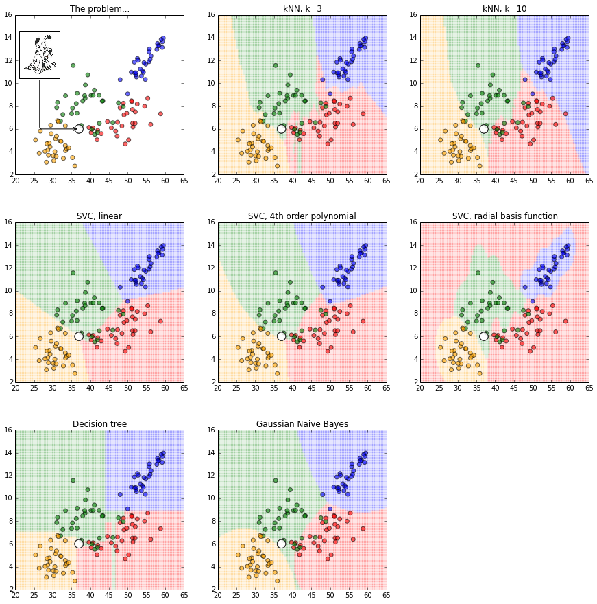

In the last two chapters, building models using data miners was characterized 
as
a _division_ process that breaks the whole data into sub-regions.
Also 
that process can be initialized via discretization that divides sets of numbers.

This chapter expands on that characterization. First, we discuss model building
as iterative  discretization. Next, we discuss other kinds of learners that use
of other ways to divide the data.

Before discussing standard learners (at the end of this chapter), we first discuss
two learners (called STAR and FFtrees) 
that are so simple, that the reader could quickly implement their own
versions. These first two examples will show:

- Just how simple are some of the core learning processes
- How data miners can be refactored in many ways to serve many purposes. For example, as discussed below,
  the "data miner" called STAR can be used for regression, classification, monitoring, and optimization.

XXX wheich learenr is best.
wolpert

## Iterative Discretization

### STAR

If descretizers  divide a whole space into interesting parts, why not build
models by just iterating  the same process within each part?
For example, STAR is a rule learner where most of the work is in the discretization
(followed by a little greedy search).

STAR
uses some unsupervised discretization to divide all the independent numeric columns into bins.
After  sorting the bins according to some domain specific criteria, it tests
the effect of a rule built from walking through:

- just the top sorted bin; 
- then the top sorted bins; 
- then the top three;  
- etc.

STAR's walk stops when the effect of the first $$i$$ bins is not better than the first $$i-1$$
(at which points it recommends all the bins 
$$1 to i-1$$).
In practice, STAR often [stops very early](REFS#menzies-2007) (after  just  a few steps).
For domains where early stopping happens,  STAR a useful method for generating tiny rules.

XXX example here. from ase paper.

More specifically, STAR divides a numeric dependent column into (say), 20\% best values and 80\% rest. 

- Let the number of rows in best and rest be $$n_b,n_r$$, respectively.
- Each bins $$X$$ in the independent columns appears at some frequency $$f_b,f_r$$ in best and rest.
- The preferred bins are those that (a) occur frequently in best and (b) occur more frequently in
  best than rest. 
     - That is, the rank of bin $$b_i$$ is $$R(b_i)=p^2/(p+q)$$ where $$p=f_b/n_b$$ and $$q=f_r/n_r$$.
- Using $$R$$, STAR sorts all the bins $b_i$ into the list
  `$$b_1,b_2,b_3,...$$` in descending order of rank (so  `$$R(b_i) \le R(b_{j>i})$$`).
- STAR then walks over the first $$i=1$$ bins, 
  then the first $$i=2$$ bins, and so on.

If you want to implement STAR, here are some important details:

- To score a set of bins:
     - find all the rows that match those bins
     -  then compute the mean of the dependent variable in those rows.
- To fast find rows that contain a bin, use _set indexing_: 
     -  Build a data structure that stores a bin, plus a set of rows that have that bin.
     - Once build, finding the rows is a simple look-up into that set.
     - Note that this data structure can be populated in the initial unsupervised discretization process.
- To fast find rows that satisfy the first $$i$$ bins, use _set operations_:
     - If ranges are stored in sets (as per the last tip), then  take the $$i$$ bins are divide them
       according to what attributes they use.
     - First run over all the attributes and combine their sets using a set union operator
       (e.g.  when combining the rows using _age=low_ and _age=high_, you want to find the rows
       with  _age=(low or high)_, which can be done via set union).
     - Second,  run over the rows from different attributes and combine those sets with a set intersection operator
       (e.g. if 20 rows have _age=hi_ and 10 rows have _car=ford_ then a set interesction will find the
        subset of the 20 rows having _age=hi_ and _car=ford_).
     - Note that many programming languages offer very fast set implementations. For example, Python's
       set operations run straight down to some highly optimized C/assembler routines.
- As STAR walks through a  large number of $$i$$ bins, most of the benefit is seen
  in the first few bins
  (after which, it is a case of diminishing returns). Therefore, Greg Gay[^keys2] recommends to add it more and more
  bins at each step. That is:
     - At first, try jsut the top ranked $$i=1$$ bin.
     - Next , try add in two more bins (so now we are looking at bins $$i_1,i_2,i_3$$;
     - More generally,  at step $$j$$, always add $$j$$ more bins.

[^keys2]: See his [KEYS2 algorithm](http://citeseerx.ist.psu.edu/viewdoc/download?doi=10.1.1.650.3238&rep=rep1&type=pdf).

STAR can  be used for:

- Regression on numeric classes: As described above, STAR will return a set of bins that most
  select for some desired (say) 20% outcome. Note that STAR can also report the
  uncertainty in that prediction (by printing out not just the mean of the rows selected by the bins,
  but also the standard deviation). This is a nice feature since it tells you not only
  what we know, but also how well we know it.
- Classification on discrete classes: Here,  we do not divide the rows 20%/80% but instead make _best_ the class you
  wish to identify. In this scenario, the bins reported by STAR are a rule for distinguishing that class
  from everything else.
      - Note one limitation with STAR: when used for discrete class classification, it is only a binary
        classifier. That is, STAR-as-classifier can only distinguish between _it_ and _not it_.
      - That said, when used with set indexing  set operations (see above), STAR is so fast that it is pratical
        to run it _N_ times for _N_ classes (each time looking for ways to distinguish class _A_ from classes _BCD_;
        then distinguishing class _B_ from clases _ACD_, etc).
      - When STAR-as-classifier is run _N_ times for _N_ classes, it will generate _N_ rules.
        Hence, when tested on new data, it is possible that more than one rule will trigger. In this case,
        select the class that comes from the rule with most support (i.e. its bins selected most rows in the training
        data).
- Monitoring: in this case, we make _best_ the thing we _do not_ want to happen (e.g. the worst class
  or the lowest 20% of the scores). In this scenario, the bins reported by STAR are a recommendation
  for how to achieve the higher scores.
      - When monitoring for discrete classes
- Optimization: Suppose the data being explored comes from some simulator. After STAR returns its first round
  of recommendations, these can be used to seed a second run of (say) 1000 samples from the simulator.
  These second results could then seed a third round, and so on.
  In this scenario, STAR's bins are suggestions on how to better control a simulation.
- Multi-goal optimization: If the rows have multiple numeric goals (some of which are to be minimized and some are to be maximized),
  use some _aggregation_ function to combine these into on dependent variable (which STAR can divide
   into 20\% best and 80% rest). 


Further to the last point, for aggregating multiple goals, we recommend
[Zitler's indicator method](REFS:zitler-2004)
since this known to [better aggregate  multiple-goals](REFS:sayyad-2013).
This method reports what loses least: moving from _here_ to _there_
or _there_ to _here_
(and the row _here_  is preferred if moving to _here_ results.
The slow way to apply the indicator is apply it to all pairs of rows in the data.
A faster way, that is still useful, is to compare each row to (say) 100 other rows.
Note that, in the following code:

- In the weights array,  -1,1 means "minimize, maximize" respectively.
- Objective scores are normalized 0..1 since, otherwise,
the exponential calculation might explode.

```python
def x_better_than_y( 
            x,y,     # two rows
            weights, # dictionary of objective weights,
            goals,   # list of goal indexes
            lo, hi): # lists of low,high values of goals  
    xloss, yloss, n = 0, 0, len(w)
    for g in goals:
        a      = normalize( x[g], lo[g], hi[g] ) 
        b      = normalize( y[g], lo[g], hi[g] )
        w      = weights[g]
        xloss -= 10**( w * (a-b)/n )
        yloss -= 10**( w * (b-a)/n )
    end
    return xloss/n < yloss/n

def normalize(z,lo,hi): return  (z  - lo) / (hi - lo + 0.00001)  
```

XXX humbling how few thigns matter

### FFTrees


Fast and Frugal Trees (FFtrees)
 were developed by  psychological scientists~\cite{martignon2008categorization}  
trying 
 to generate succinct, easily comprehensible models. We first used them as an  explanation tool, but  
realized that they had  broader implications.
 
FFtrees are  binary trees that 
return a binary classification (e.g., true, false).
Unlike standard decision trees, 
each level of an FFtree
must have at least one leaf node.
 For example,  
 \tbl{three} shows an FFTtree generated from
        the log4j JAVA system of \tbl{versions}.
        The goal of this tree is to classify a software module as ``defective=true'' or ``non-defective=false''.
         The four nodes in the \tbl{three} FFTree  reference  four  attributes \emph{cbo,\ rfc,\ dam,\ amc}  (defined in  
        \tbl{ck}). 
  
  
  \begin{table}[!b]
  \captionsetup{font=small}
\caption{An example FFtree  generated from  \tbl{versions} data sets. Attributes come from \tbl{ck}.
``True'' means ``predicted to be defective''.}\label{tbl:three}
% \begin{minipage}{.35\linewidth}
\begin{verbatim}
              if      cbo <= 4    then false      
              else if rfc > 32    then true         
              else if dam >  0    then true      
              else if amc < 32.25 then true      
              else false                         
        \end{verbatim}
\end{table}
% \end{minipage}\begin{minipage}{.37\linewidth}
% {\scriptsize
% \begin{verbatim}
%   if       cbo    <   4   then true    
%   else if  max_cc <   3   then true    
%   else if  wmc    <  10   then true    
%   else if  rfc    <= 41.5 then true    
%   else false                           
%   \end{verbatim}} \end{minipage}\begin{minipage}{.33\linewidth}
% \vspace{-3mm}{\scriptsize \begin{verbatim}
%   if       dam > 0 then false     
%   else if  noc > 0 then false     
%   else if  wmc > 5 then false     
%   else if  moa > 0 then false     
%   else true                       
% \end{verbatim}}
% \end{minipage}
%\end{table}


Following the advice of~\cite{phillips2017FFtrees}, we use trees with   depth     $d=4$.
This means that
our FFtrees make their decisions using at most four attributes (where numeric ranges have been binarized by splitting at the median point). 

Standard rule learners     select
ranges that best select for some goal (e.g., selecting for the ``true'' examples). This can lead to overfitting.
To avoid overfitting, FFtrees use a somewhat unique strategy:
 at each level of the tree, 
FFtrees builds two trees using the ranges  that  {\em most} and {\em least}  satisfy some goal; e.g., {\em d2h} or {\em Popt20}.
That is, half the time, FFtrees will try to avoid the target class by building a leaf node that exits to ``false''.
Assuming a maximum tree depth of  \mbox{$d=4$} and two choices at each level, 
then FFtree builds   $2^d=16$ trees then prunes away all but one, as follows, firstly, it selects
a goal predicate; e.g., {\em d2h} or {\em Popt20}.
Next, while {\em building one tree}, at each level of the tree,   FFtree scores
each range according to how well  that range \{does, does not\} satisfy that goal.
These  selected range becomes a leaf note. FFtree then calls itself
recursively on all examples that do not fall into   that range.
Finally, while {\em assessing 16 trees}, we run the training data through each tree to find what examples
are selected   by that tree. Each tree is scored by passing the selected examples  through the goal predicate.
The tree with the best score is then applied to the test data.

In summary, FFtrees {\em explore around} a few dozen times, trying  different options for how to best model the data (i.e., what exit
node to use at each level of the tree).
After a few  {\em explorations}, FFtrees deletes the worst models, and uses the remaining model on the test data. 
 \begin{figure}[!t]
{\scriptsize
\begin{tabular}{cc}

{\em D2h}: {\em less} is {\em better}. 
&
{\em Popt(20)}: {\em more} is {\em better}. \\
``small effect'' $= 5.1$
&
``small effect'' $=5.2$\\
\includegraphics[width=1.6in]{d2huntuned.png}&\includegraphics[width=1.6in]{pot20untuned.png}\\
\multicolumn{2}{c}{ \includegraphics[width=2in]{keyuntuned.png}}
\end{tabular}}
\captionsetup{font=footnotesize}

 \caption{Defect prediction results for FFtree vs  untuned learners. From~\cite{chen2018applications}.
FFtrees is  almost never beaten  by  other methods  (by more than a ``small effect'').
Exception: see the synapse+EM results in the left column.
}\label{fig:chen}
\end{figure}

## Learning as Division

examples of division

before you getting all bent out of shape[^shape] about how to tweak the decision boundary fo fit the data,
recall that one of the points of 

also, some of these ways to find boundaries are much slower, and take more memory,  than others.
For example linear SVMs are faster than other kinds of SVMs and Naive Bayes classifeirs are very fast indeed.
Also, NaiveBayes classifiers require very litt
[^shape]: This is a joke (albinet a very weak one).





active elarning

goal custering

fft trees

https://en.wikipedia.org/wiki/Logistic_regression#/media/File:Exam_pass_logistic_curve.jpeg
w

Amazing how few you need. median chops

Sctott knott is a deicretizer

LSH is a discretizer

ARGMOST


For more on discretizatin, see after
applying some unsupervised discritizer, find 

, used in learners in FFtrees
 it would
be ts indepednent and depednet columns,
 
 columns
values to car about) but you can sometimes lose some of the numeric nuances.


