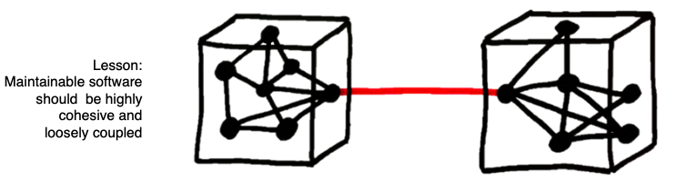

{: .imgright}

This book is about using better software engineering to build better AI software. 
 AI is a very broad topic, discussed in
 [so](REFS.md#norvig-2009) 
 [very](REFS.md#grus--2019)
 [many](REFS.md#duda-2000)
 [other](REFS.md#witten-2016)
 books. Sp what makes this book so different?

Firstly, in this book, **ethics is a primary design principle**.
We assert that the design goals for SE-for-AI must be _ethically-aligned_
to prioritize human well-being.
It is ethical to improve
the profits of your company since that money becomes wages which
becomes groceries which becomes dinner so everyone and their kids
can sleep content at night
It is also ethical to change the design
of AI software in order to ensure   that (say) the software is not
unduly discriminatory towards a particular social group (e.g. some
groups characterized by age, race, or gender). 
We suggest to you that when you start a new AI project,
your  first question should not be  be  "what data miners should I apply to this data?".
Rather, it should be  "what are the ethical requirements of this development? And how can we best support those requirements?".

Secondly,  we look
 at AI tools which,  recently, have had a major   impact on software
 engineering. Specifically, we will talk much about data mining
 algorithms; some about optimizers; and a little about theorem
 provers.  (and we will say more about  all these,
 [below](#tools-and-data)).

 
Thirdly, the authors of this book have spent decades applying many
AI tools ( mostly  for software engineering applications). We share
some of that case study experience in this book.
 
## Is "SE for AI" all that important?

  It is timely to talk about SE for AI. **AI software is still
  software** and   all  software
   (be it AI software, or otherwise) needs installation, configuration,
   maintenance, interfacing to other software, testing, certification,
   user support, usability additions, and packaging (for distribution).
   As shown below, Bill Benton from Redhat [reports
   that](REFS.md/#benton-2019) that when we look at the data mining
   pipelines used to distribute and scale AI tools, there is  much
   overlap between the activities of data scientists and   more
   traditional activities  like data engineer and application
   developer. That is, **AI software needs care and feeding by
   software engineersi**.

  {: .image800}

Another reason to explore SE for AI is that **most "AI software"
   is not about AI**.   David Sculley  [offers the following
   diagram](REFS.md/#sculley-2015) showing the size (in lines of
   code) of  Google's software suite. Note how small is the AI box
   (shown in black), buried away in the middle of all the other
   software.

  {: .image800}

Since AI software is still software, it follows that **poor
   software engineering leads to poor AI**. Again, David Sculley
   [offers us an example of this](REFS.md/#sculley-2015).  He reports
   that Google's machine learning developers used all of the
   attributes in Google's data dictionaries to learn predictive
   models about browsing habits. This lead to problems since any
   subsequent change in the data dictionary meant that all the data
   mining had to be done, all over again. In software engineering
   terms, Google had introduce technical debt (i.e. something that
   will consume maintenance money at some future date) by violating
   principles of coupling and cohesion. Maintainable systems are
   loosely coupled (but internally, tightly cohesive). Google's
   classifiers, on the other hand were tightly coupled with their
   data dictionaries.  A better design, that would have looser
   coupling would have been to apply some sort of feature weighting
   to the data, and only connect to the least features that were
   most influential.

  

While poor software engineering can lead to problems with the AI,
the good news is that
   **better SE can lead to better AI**. For example, many industrial
   data scientists make extensive  use of the [Python scikit-learn
   toolkit](REFS.md#pedregosa-2011) data mining package. Started
   in 2007 as a Google Summer of Code project by David Cournapeau,
   numerous releases have appeared following a (approximately) three
   month cycle, and a thriving international community has been
   leading the development. At the time of this writing, over the
   last month, this software has been maintained and extended by
   dozens of authors, spread around the planet (specifically,
   excluding merges, 50 authors have pushed 119 commits to master
   and 119 commits to all branches to make changes thousands of
   lines of code in  279 files). All this is possible since
   scikit-learn uses state-of-the-art open source software engineering
   methods (continuous integration, cloud-based testing with Travis
   CI, git, github, etc etc).

Since good SE can lead to better AI, we devoted many  chapters of this book to industrial data mining pipelines.   Recently we reversed engineering a nine step pipeline for industrial machine learning.  For simplicity's sake, we draw it as steps that run left to right (but in reality, **AI is an agile process** where we jump around these steps, as required):

  {: .image800}

   We also surveyed many industrial data scientists to understand how much time they spend on different parts of this pipeline:

{:height="20px" width="94px"}

|part|hrs/week (mean, approx)|bar chart|
|------------|---|-----------------------------------------------------|
|requirements|4.4|          {:height="20px" width="94px"} |
|collection |4.7|          |
|cleaning   |4.5|          |
|labelling   |2.9|          |
|feature engineering | 4.6| |
|training    |5.4|          |
|evaluation  |3.8|          |
|deployment  |5.1|          |
|monitoring  |2.6|          |

One interesting feature about the above histogram is that 
**most "data mining" is not about mining the data**.  We say this since, in  a 35 hour work week, only half a day (5.4.hours) was spent in _training_. This is interesting since most data mining textbooks _only_ talk about training. Hence, if we are going to talk SE for AI, there is a pressing need to discuss all the work that fills up the other four days of the week.  

##   Tools and Data

We cannot leave this chapter without some introductory notes on the AI tools we study.  
More experienced readers might decide to skip this section.

**_Data mining algorithms_ tell us "what is" in the datai**. Data miners extract models   from data. For example, from columns of numbers and _programmer experience_, _development language_, and   _number of observed defects_, then a data miner might learn that defects are  more dependent on the experience of the programmer than the language that they use.  Example  data mining algorithms
    are  nearest neighbor algorithms like kNN; clustering algorithms like k-Means and EM; statistical learners like Naive Bayes; equation learners like linear or logistic regression; decision tree learners like C4.5,   and CART; meta-learners like AdaBoost; and many other as well including  Apriori,, PageRank,  neural networks (and deep learners); etc.

**_Optimizers_ tell us "what to do"**. Optimizers look  at models and tell us how changes in something effects something else. Ideally, optimizers also tell us the _least_ we need to do to _most_ improve something. For example, an optimizer might report that defects can are most reduced   using   developers with two years of experience. They might also report that improving experience to three, four, five years (and above) offers little extra reduction in observed defects. Example optimizers include genetic algorithms like NSGA-II, MOEA/D and differential evolution;   sequential model-based optimization methods like FLASH and SMAC; and other approaches such as particle swam optimization, tabu search; and many more besides

**Theorem provers** are very specialized tools for finding settings to variables that satisfy the logical constraints of a model. Such a theorem prover might report that  A=true and B=false satisfies the constraint (A and not B).   For example, the constraints of the kernel of the Linux operating system can be expressed as hundreds of thousands of constraints.  When optimizing the design of some new version of Linux (e.g. to try and avoid  modules  with a track record of problems) we can use theorem provers to (a) generate a population of valid designs; and (b) check the validity of a new design. Example theorem provers include  maxWalkSat, pycoSAT, MathSAT, vZ, Z3,  and many more besides.

Note that **optimizers are model-based** and **data miners are data-based**. 

- Data miners explore whatever data is available.
-  Models, on the other hand, can be used to build more data whenever they want, just by running the model some more. 

This means that:

-  Data miners explore a fixed data space;
-  While optimizers explore a more fluid data set by zooming into little cracks in the data, expanding that part of the data as they go.

Note also that optimizers and data miners are tightly inter-connected:

- Data miners can learn a model which [can be used by optimizers](REFS.md#feather-2002).  
- Optimizers can [adjust the control parameters of a data miner](REFS.md#fu-2016) such that those data miners learn better models (technical note: this is called [search-based software engineering](REFS.md#harman-2012)).
     

## Quiz

In this page,  find two technical terms; e.g. the CART data miner, e.g. the NSGA-II optimier
or e.g. the Z3 theorem prover.

Find papers in the recent SE literature that have used that term.

Method1: see if you can find your term in  [this paper](https://arxiv.org/pdf/1812.01550.pdf). If so, use references from this 
papers.

Method2:

- For TERM in TERMS, go to Google Scholar Advanced Search
    - For VENUE in ICSE FSE ASE "transactions software engineering" "Journal of Systems and Software" "Information Software Technologies" do
         - Set "Return articles published in" to VENUE
         - Set "with all of the words" to TERM 
         - Set "Return articles dated between" to the last ten years
         - Find a  paper that uses TERM in an interesting way. 
           Hint: only read paper with "enough" citations citations (for the last two years, "enough"=0; for anything
           before that, "enough"=10 cites/year)
         - Sumamrize the paper under the following headings (usually, 2-3 lines each).

Note that most of the time for this exercise will be spent
finding cool papers.

Headings:

- Your name():
- Term:
- Write a ten line summary of what this does? Input? Output? Processing? Indications for when to use it? Not use it?
- Paper Title:
- Year:
- Venue:
- Authors:
- URL for download (if you can find it):
- Requirements (if found): what was the goal of the work? anything declared out of scope?
- Data collection (if mentioned): how was it done?
- Data cleaning (if done): any sanity checks on the data? repairs to strange fields?
- Data labelling (if needed): any need to assign values to the data before anything else (e.g. "good project", "this is a bad poject"). How was it done? How were those labels checked? What was the effort in that labelling process?
- Training (if done): how was it done? Anything mentioned about issues with training? (e.g. long CPU times)
- Evaluation (if done): what metrics were applied (define each one)? how were the results summarized (list statistical tests and visualizations used). If cool visualizations, include them here.
- Deployment (if done): how was this scaled up? Delivered to many users?
- Monitoring (if done): if deployed, how did the developers watch over this development?
