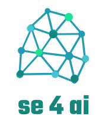

AI software is still software. As such it needs
maintenance, validation, interfacing to other software, and usability additions.
That is, AI software needs care and feeding by software engineers.

The more SE people know about AI, the better they can apply this exciting new technology.

So, do you know enough about AI?

32323
```python

```
